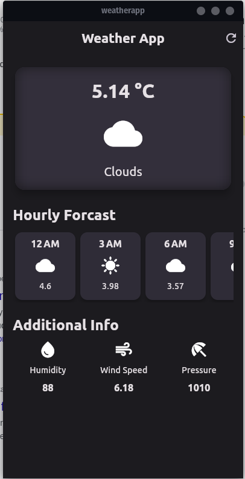

# weatherapp

This is another weather flutter project that I am working on. This project is a simple weather app that uses the OpenWeatherMap API to get the weather data. The app will display the current weather and the forecast with some additonal info.

## Screenshot

The app looks like this:

